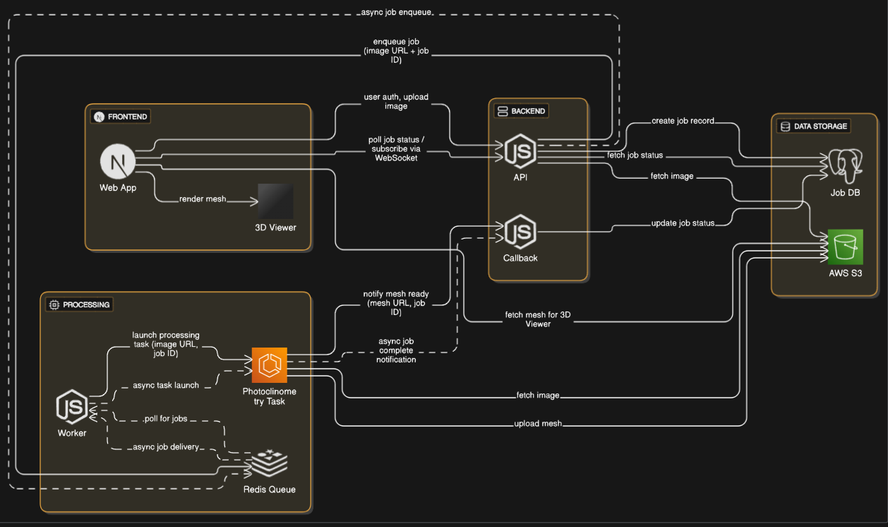

# Project Architecture



---

## 1. Project Overview

This application enables users to **upload high-resolution lunar images**, automatically **generate a 3D mesh** using photoclinometry (shape-from-shading), and **visualize the result interactively in the browser**.

**Photoclinometry** leverages variations in image brightness, sun angle, and camera metadata to estimate surface elevation from a single image, producing a digital elevation model (DEM) and 3D mesh.

---

## 2. System Architecture

The system is designed as an **asynchronous, scalable pipeline** to efficiently handle large image files:

1. **Image Upload (Next.js Frontend):**  
   Users upload lunar images via a web interface.

2. **Backend Processing:**
   - The backend (Next.js API route) uploads the image to AWS S3.
   - It then enqueues a processing job in Redis.

3. **Job Worker & Compute:**
   - A worker service polls Redis for new jobs.
   - When a job is available, it triggers an AWS ECS Fargate task.

4. **ECS Task (Dockerized Python):**
   - The ECS task runs a Docker container with a Python script.
   - The script uses `rasterio` (with windowed/tile-based loading) and OpenCV to process the image and generate a 3D mesh.

5. **Result Handling:**
   - The generated mesh is uploaded to S3.
   - The worker notifies the backend with the mesh URL.

6. **Frontend Visualization:**
   - The frontend polls the backend for job status.
   - Once ready, the mesh is loaded and displayed interactively using Three.js (`@react-three/fiber`).

---

## 3. Technologies Used

- **Frontend & API:** Next.js
- **File Storage:** AWS S3
- **Job Queue:** Redis
- **Compute:** AWS ECS Fargate (Docker containers)
- **Image Processing:** Python (`rasterio`, OpenCV)
- **3D Visualization:** Three.js (via `@react-three/fiber`)

---

## 4. Performance Optimizations

- **Lazy Loading & Tiling:**  
  Use `rasterio` windowed reading to process only image tiles in memory, preventing crashes on large files.
- **Downsampling:**  
  Use `cv2.INTER_AREA` for efficient, quality-preserving downsampling before mesh generation.
- **Asynchronous Compute:**  
  ECS-based job execution allows horizontal scaling and non-blocking user experience.

---

## 5. How to Run Locally (Optional)

1. **Start Next.js App:**
   ```sh
   npm install
   npm run dev
   ```

2. **Set Up Local Redis:**
   ```sh
   docker run -p 6379:6379 redis
   ```

3. **Run Python Processing Script in Docker:**
   ```sh
   docker build -t moon-mesh .
   docker run -v %cd%/data:/data moon-mesh python process_image.py /data/input.img /data/output.obj
   ```

---

## 6. Deployment

- **ECS Task Definitions:**  
  Define Docker image, resource limits, and environment variables for S3/Redis.
- **S3 Bucket Structure:**  
  - `/uploads/` for raw images  
  - `/meshes/` for generated 3D models
- **Job Status Tracking:**  
  - Job status and result URLs are tracked in Redis and surfaced via backend API endpoints.

---

## 7. Future Improvements

- **WebSocket Support:**  
  Push real-time job status updates to frontend.
- **Automatic ROI Detection:**  
  Auto-select regions of interest for mesh generation.
- **Full Moon Tiling & Stitching:**  
  Process and combine tiles to reconstruct the entire lunar surface.

---